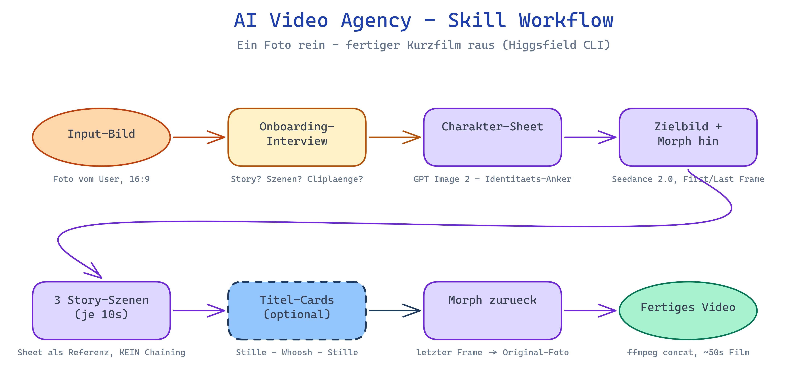
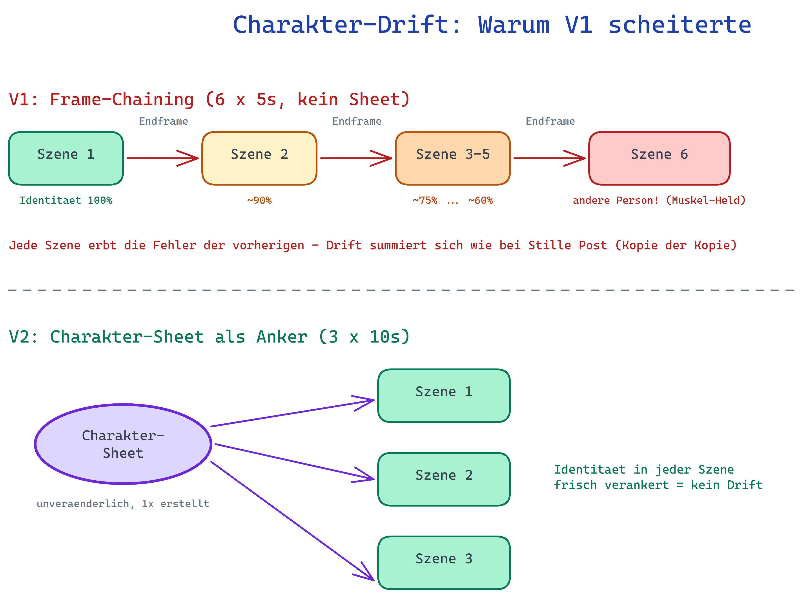

# 🎬 AI Video Agency — Skill for Claude Code & Coding Agents

## 🇩🇪 Schnellstart ohne Vorwissen (copy & paste)

Du brauchst **kein technisches Vorwissen**. Öffne deinen Coding Agent (z.B.
[Claude Code](https://claude.com/claude-code)) und füge einfach diesen Text ein:

> Klone das Repo https://github.com/Arnie936/ai-video-agency in diesen
> Projektordner und erklär mir, was es macht und was die nächsten Schritte sind.
> Installiere alle nötigen Skills und Tools (Higgsfield CLI, ffmpeg) und richte
> alles so ein, dass es klappt. Sollte ich Git noch nicht installiert haben,
> installiere zuerst Git. Wenn ich noch keinen Higgsfield-Account habe, zeig mir
> wo ich einen erstelle.

Der Agent erledigt den Rest: Er installiert alles, prüft was fehlt und führt
dich Schritt für Schritt zum ersten Video. Einen Higgsfield-Account (die
Video-KI dahinter) erstellst du hier: 👉 **https://higgsfield.ai/s/mcp-arnold-oberleiter-PGBQCb**

---

## How it works



Why the character sheet matters — the failure mode this skill was built around:



Turn **one photo** into a complete cinematic AI video story — with a consistent
main character, a real narrative arc, and seamless transformation morphs. This
skill makes your coding agent behave like a full-service AI video agency: it
interviews you, writes the script, generates every asset, and assembles the final
video.

**Example output pipeline (~45 seconds of video):**

```
You (photo) ──morph──▶ Caveman ──▶ 3 cinematic story scenes ──morph──▶ You (photo)
```

Built on [Higgsfield](https://higgsfield.ai/s/mcp-arnold-oberleiter-PGBQCb)
(GPT Image 2 + Seedance 2.0) and battle-tested against the classic failure mode of
multi-scene AI video: **identity drift**.

## ✨ What it does

- **Onboarding like an agency**: give it your start photo — it analyzes pose,
  lighting and features, then asks what story you want to tell, how many scenes,
  how long the clips should be.
- **Character sheet**: generates a multi-angle identity reference from your photo
  (the key trick that keeps your face consistent across every scene).
- **Transformation bookends**: first-frame/last-frame morph videos that transform
  you into your character and back at the end.
- **Story scenes**: independent cinematic clips (default 3×10s) with a
  hook–struggle–triumph arc, all referencing the character sheet.
- **Assembly**: concatenates everything into one final video with ffmpeg.

Works for personal story videos, YouTube hooks, Shorts/TikTok, ads and brand
stories.

## 🚀 Setup

1. **Get a Higgsfield account** (the generation backend):
   👉 https://higgsfield.ai/s/mcp-arnold-oberleiter-PGBQCb

2. **Install the Higgsfield CLI**:
   ```bash
   curl -fsSL https://raw.githubusercontent.com/higgsfield-ai/cli/main/install.sh | sh
   higgsfield auth login
   ```

3. **Install the official Higgsfield skills** (this skill builds on them):
   ```bash
   npx skills add higgsfield-ai/skills
   ```

4. **Install this skill**:
   ```bash
   npx skills add Arnie936/ai-video-agency
   ```
   …or copy the `ai-video-agency/` folder into your agent's skills directory
   (e.g. `~/.claude/skills/`).

5. **Install ffmpeg** (frame extraction + final assembly):
   `winget install ffmpeg` (Windows) / `brew install ffmpeg` (macOS) /
   `apt install ffmpeg` (Linux).

## 🎯 Usage

Just tell your agent something like:

> "I want to turn myself into a viking and tell an epic 30-second story. Here's my photo."

or simply:

> "Make an AI video story from this photo."

The skill takes over: analysis → concept pitch → script sign-off → generation →
final video.

## 🧠 The method (why this works)

Most multi-scene AI videos fall apart because the character stops looking like the
same person. This workflow fixes that with three principles:

1. **Character sheet as identity anchor** — every scene references a multi-angle
   sheet of your face (plus your in-costume look) instead of chaining video frames.
   Frame chaining compounds drift; after 6 chained scenes the character is a
   different person. Independent cuts + one shared reference stay stable.
2. **Pose symmetry** — the story's final scene deliberately ends in the same pose
   as your start photo, so the reverse morph lands perfectly.
3. **First/last-frame morphs** — transformations use Seedance 2.0's
   `--start-image`/`--end-image`, with a motivated trigger (finger snap) and
   explicitly enumerated changes.

## 📁 Structure

```
ai-video-agency/
├── SKILL.md                      # the agent workflow
├── README.md
└── references/
    ├── prompting-guide.md        # proven prompt templates per phase
    └── troubleshooting.md        # identity drift, CLI errors, morph fixes
```

## 💳 Costs

Generation runs on your Higgsfield account credits. A full production
(character sheet + target image + 2 morphs + 3×10s scenes) is a handful of
image jobs and ~40s of Seedance 2.0 video.

## 📜 License

MIT — use it, fork it, ship videos with it.
